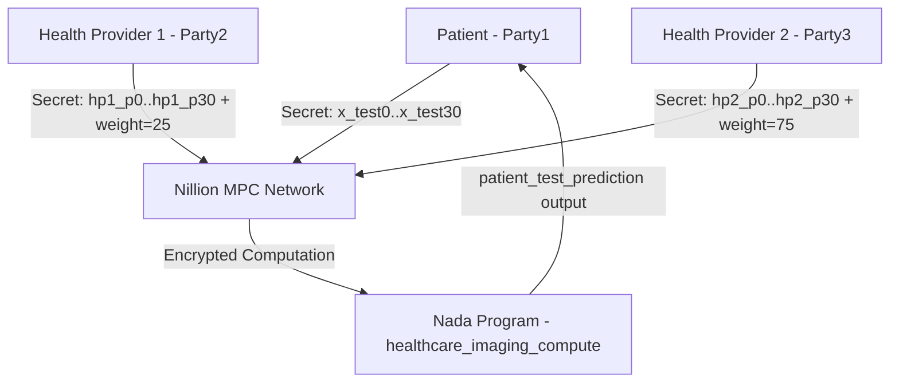

# 🔐 ZeroTrust Health — Deep Dive Analysis

## What Is This Project?

**ZeroTrust Health** is a blockchain/crypto-adjacent AI demo that shows how **blind computation** (Secure Multi-Party Computation — MPC) can be applied to healthcare data. Specifically, it performs **breast cancer classification** without any single party ever seeing the full dataset.

> **Core Idea**: Multiple health providers each hold a private piece of training data. A patient submits their scan data. The prediction happens on Nillion's decentralized MPC network — nobody sees anyone else's raw data, yet a diagnosis result is produced.

---

## 🏗️ Architecture Overview



**3 parties, all secrets stay private. Only the final output (prediction) is revealed to Party1.**

---

## 📁 Project Structure

```
ZeroTrust-Health/
├── zerotrust_ml_core/       # Main Python program
│   ├── healthcare_imaging_compute.py # ← MAIN ENTRY POINT (451 lines)
│   ├── config.py                     # Party/environment config
│   ├── utils/
│   │   └── func.py                   # Math utilities
│   └── data/
│       └── cancer_data.csv           # UCI breast cancer dataset (569 rows)
│
├── nada_circuits/
│   └── healthcare_imaging_compute.py # ← NADA MPC PROGRAM (runs on Nillion network)
│
├── circuits-compiled/                # Compiled .nada.bin files go here
│
├── helpers/
│   ├── nillion_client_helper.py      # Nillion client factory
│   ├── nillion_payments_helper.py    # Blockchain payment config
│   └── nillion_keypath_helper.py     # Key file helpers
│
├── bootstrap-local-environment.sh    # Starts Nillion devnet + generates keys
├── compile_circuits.sh               # Compiles Nada programs to MIR bytecode
├── requirements.txt                  # Python dependencies
└── docker-compose.yml               # Docker alternative to local setup
```

---

## 🔑 Key Technologies

| Technology | Role |
|---|---|
| **Nillion** | Decentralized MPC / blind computation network |
| **Nada DSL** | Python-based DSL to write programs that run ON Nillion |
| `py-nillion-client` | Python SDK to interact with Nillion nodes |
| **NumPy** | Linear algebra for Logistic Regression (normal equation) |
| **Pandas** | CSV dataset loading and splitting |
| **Matplotlib + Seaborn** | Distribution plots of feature data |
| **python-dotenv** | Load `.env` secrets (Nillion keys, cluster IDs) |
| **UCI Breast Cancer Dataset** | 569 samples, 30 features + Diagnosis (M/B) |

---

## 🧠 The ML Algorithm (Linear Regression via Normal Equation)

The model is **not** a neural network. It's **plain linear regression** solved analytically:

```
θ = (XᵀX)⁻¹ Xᵀy
```

- **X** = feature matrix (30 breast scan parameters per patient)
- **y** = diagnosis target (1 = Malignant, 0 = Benign)
- **θ (theta)** = learned coefficients (31 values including intercept)

**Why?** Because you can represent dot products of integers on the Nillion network. Neural networks would require floating point operations that MPC doesn't natively support efficiently.

### Data Splitting Strategy

```
Full Dataset (569 rows)
    ├── Train (80% = ~455 rows)
    │     ├── HP1 Subset — Small (25% of train = ~114 rows) → theta_subset_sm
    │     └── HP2 Subset — Large (75% of train = ~341 rows) → theta_subset_lg
    └── Test (20% = ~114 rows)
          └── 1 random row selected for blind compute test
```

### Weighted Average Theta Combination

Each health provider's theta is weighted by dataset size:
```python
combined_theta = theta_sm * 0.25 + theta_lg * 0.75
```

This is also replicated **inside the Nada program** (running blindly on Nillion):
```python
combined_theta[i] = (hp1_param * 25) / 100 + (hp2_param * 75) / 100
```

---

## 🔢 The Scaling Problem (Critical Design Decision)

Nillion's MPC network only supports **integers** (no floats). But theta values from linear regression are floats like `-0.000432`.

**Solution**: Multiply everything by a scaling factor before sending to Nillion.

```python
# Find precision needed (e.g., 10 decimal places)
precision = 10
scaling_factor = 10 ** (10 - ceil(log10(max_abs_value_in_theta)))

# Scale theta (float → int)
scaled_theta = [round(value * scaling_factor) for value in theta]

# After computation, descale (divide TWICE because prediction = x * theta)
# x is also scaled, so result = (x * sf) * (theta * sf) = x*theta * sf²
patient_prediction = result / scaling_factor / scaling_factor
```

---

## 🏃 How the Program Runs (Flow)

### Phase 1: Classical ML (No Blockchain)
1. Load `cancer_data.csv`
2. Preprocess: Diagnosis M→1, B→0; drop ID
3. 80/20 train/test split
4. Compute θ for full, small-subset, large-subset training sets
5. Compute predictions locally and print results

### Phase 2: Blind Computation on Nillion
1. **Party1 (Patient)** stores test data as secrets on Nillion
2. **Party2 (HP1)** stores `scaled_theta_subset_sm` + weight=25 as secrets
3. **Party3 (HP2)** stores `scaled_theta_subset_lg` + weight=75 as secrets
4. Party2 & Party3 grant compute access_control to Party1
5. **Blind compute** triggered: Nillion nodes run the Nada program
6. Nada program computes: `Σ x_test[i] * combined_theta[i]`
7. Output revealed ONLY to Party1 (the patient)

---

## 📜 The Nada Program (MPC Code)

```python
# nada_circuits/breast_cancer_circuit.py (runs INSIDE Nillion network)
def nada_main():
    # 3 parties
    patient = Party(name="Party1")
    health_provider_1 = Party(name="Party2")
    health_provider_2 = Party(name="Party3")

    # Inputs (all secret — no party sees another's)
    hp1_weight = SecretInteger(Input("dataset1_w", party=hp1))   # = 25
    hp2_weight = SecretInteger(Input("dataset2_w", party=hp2))   # = 75
    # 31 patient features + 31 params per HP = 93 secret inputs total

    # Weighted average of thetas (done blindly!)
    combined_theta[i] = (hp1_theta[i] * 25 / 100) + (hp2_theta[i] * 75 / 100)

    # Dot product (blind prediction)
    prediction = Σ patient_data[i] * combined_theta[i]

    return Output(prediction, "patient_test_prediction", patient)
```

> **This is the "blind" part**: the Nillion network computes this without any node seeing the individual secret inputs.

---

## ⚙️ Environment Setup

### What `bootstrap-local-environment.sh` Does
1. Kills any existing `nillion-devnet` process
2. Starts a local Nillion devnet node cluster
3. Waits until cluster is ready (up to 160 seconds)
4. Extracts: cluster ID, websocket URL, blockchain RPC, payment contract addresses
5. Generates 5 node keypairs + 5 user keypairs
6. Writes all of this to `.env` file automatically

### What `.env` Contains After Bootstrap
```
NILLION_CLUSTER_ID=<uuid>
NILLION_WEBSOCKETS=<ws://...>
NILLION_BOOTNODE_MULTIADDRESS=</ip4/...>
NILLION_BLOCKCHAIN_RPC_ENDPOINT=<http://...>
NILLION_PAYMENTS_SC_ADDRESS=<0x...>
NILLION_CHAIN_ID=<int>
NILLION_WALLET_PRIVATE_KEY=<hex>
NILLION_NODEKEY_PATH_PARTY_1=/tmp/tmpXXXXXX
# ... Party 2, 3, 4, 5 ...
NILLION_USERKEY_PATH_PARTY_1=/tmp/tmpXXXXXX
# ... Party 2, 3, 4, 5 ...
```

### What `compile_circuits.sh` Does
- Runs `pynadac` on every `.py` file in `nada_circuits/`
- Outputs compiled `.nada.bin` binary to `circuits-compiled/`
- The main program references this binary at runtime:
  ```python
  program_mir_path = f"../circuits-compiled/{CONFIG_PROGRAM_NAME}.nada.bin"
  ```

---

## 🛠️ How to Run (Step by Step)

### Prerequisites
- Python 3.10+
- Nillion SDK installed (provides `nillion-devnet`, `nillion` CLI, `pynadac`)

### Steps
```bash
# 1. Activate virtualenv
source .venv/bin/activate

# 2. Start local Nillion devnet + generate keys + populate .env
./bootstrap-local-environment.sh

# 3. Compile the Nada MPC program
./compile_circuits.sh

# 4. Run the main program
cd zerotrust_ml_core
python3 main_compute.py

# Optional: skip matplotlib plots (useful in CI/headless)
python3 main_compute.py --disable_plot
```

### Docker Alternative
```bash
NILLION_SDK_ROOT=/path/to/nillion/sdk docker-compose up
```

---

## 📊 Expected Output Summary

The program prints:
1. First 50 rows of the dataset
2. The random test instance selected
3. θ values (full, small subset, large subset)
4. Combined θ via weighted average
5. **Local predictions**: Y values + `M`/`B` classification for full, sm, lg, combined
6. Nillion MPC prediction (should match local combined theta prediction)

---

## ❓ Key Limitations / Notes

- ⚠️ **NOT for real medical use** — explicitly stated in the code output
- The scaling factor is squared in the result (because both x and θ are scaled)
- Fixed `CONFIG_NUM_PARAMS = 31` (30 features + 1 intercept)
- The local devnet requires the Nillion SDK binary — not a pure pip install
- The program uses a single random test instance, not a full test evaluation

---

## 🔗 References
- [Nillion Network](https://nillion.com/)
- [UCI Breast Cancer Wisconsin Dataset](https://archive.ics.uci.edu/dataset/17/breast+cancer+wisconsin+diagnostic)
- [Nillion Python Starter Templates](https://github.com/NillionNetwork/nillion-python-starter)
