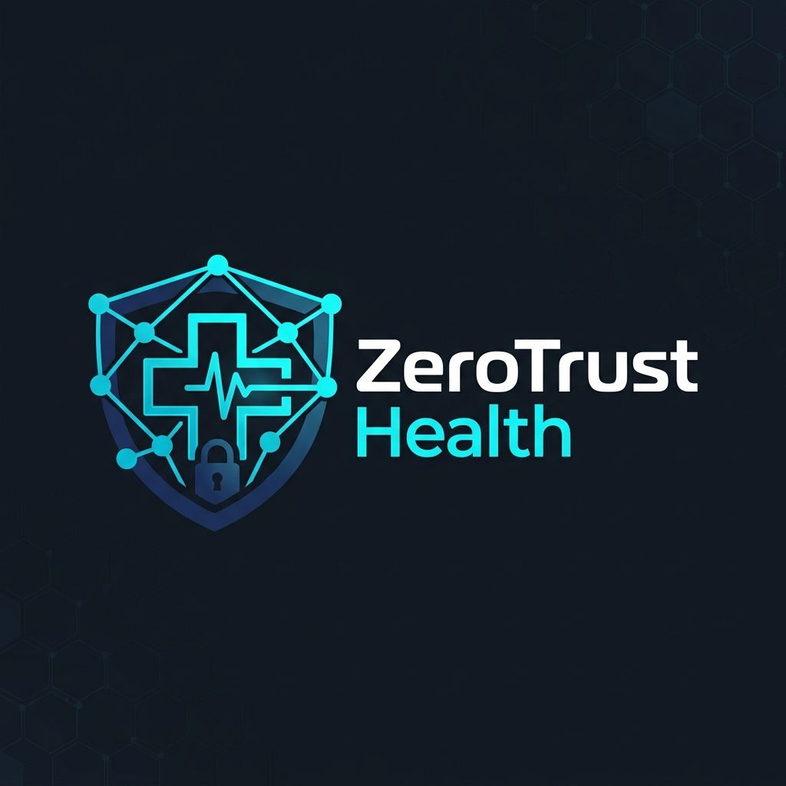
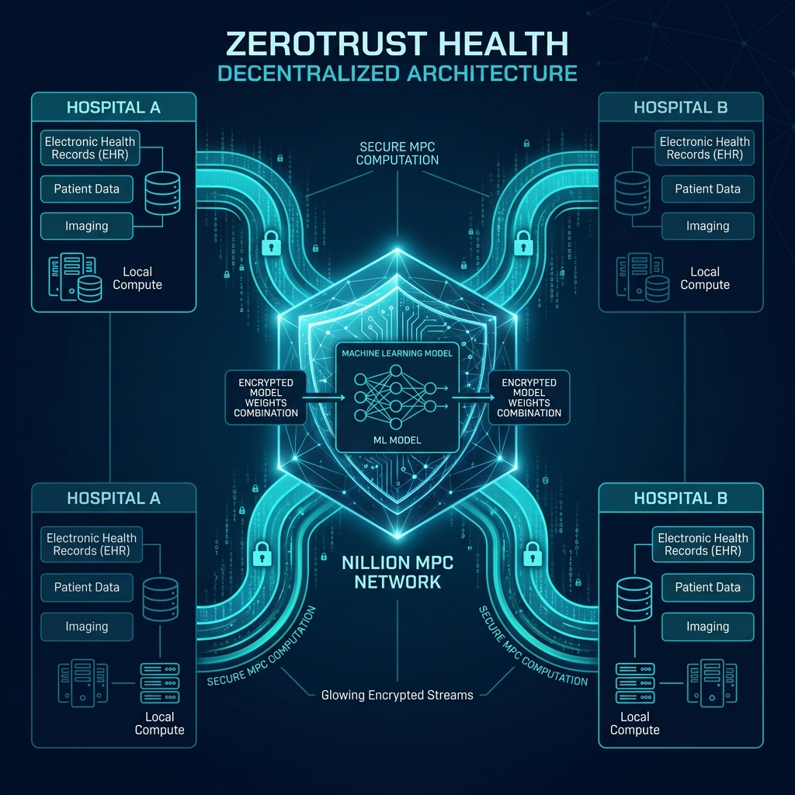

# ZeroTrust Health: FHE Diagnostics



**ZeroTrust Health** is a cryptographic engine designed to enable medical institutions to run predictive AI models on highly sensitive patient data without ever exposing the raw data itself.

Powered by **Fully Homomorphic Encryption (FHE)** via Microsoft's TenSEAL library, this platform demonstrates how to run a breast cancer classification model on purely encrypted ciphertexts.

## The Vision

In modern healthcare, data silos are a matter of life and death. Advances in AI are bottlenecked because institutions cannot legally or securely share diagnostic imaging data with one another due to strict privacy regulations (HIPAA, GDPR).

**ZeroTrust Health** solves this. By leveraging Fully Homomorphic Encryption, we can take a patient's raw diagnostic data, encrypt it into a mathematical ciphertext, and perform Machine Learning predictions *directly on the ciphertext*. The data is never decrypted during the computation phase.

## Architecture & Workflow



Our architecture is split into a localized baseline test and a cryptographic FHE execution:

### 1. Local Baseline Training
- Analyzes over 550 diagnostic instances containing 30 unique cellular parameters and 1 target diagnosis.
- Generates regression coefficients (thetas) representing the trained model.

### 2. Fully Homomorphic Encryption (FHE) Execution
- Utilizes the **CKKS Scheme** via TenSEAL, which allows for approximate homomorphic arithmetic operations on floating-point numbers.
- A test patient's diagnostic row is fully encrypted.
- The cryptographic engine computes a dot product between the encrypted data and the model weights.
- The resulting ciphertext is then decrypted, proving that the prediction matches the plaintext reality perfectly.

## Core Infrastructure Stack

- **TenSEAL FHE Protocol**: The backbone for homomorphic encryption, utilizing the CKKS scheme.
- **Machine Learning Integration**: Leverages standardized diagnostic imaging cancer data from the UC Irvine repository.
- **ZeroTrust Execution Environment**: The localized pipeline for processing the encrypted math.

---

## Installation & Setup

### Requirements
- Python 3.11+
- Terminal / CLI

**1. Clone the repository**
```bash
git clone https://github.com/mohammadali-2000/ZeroTrust-Health.git
cd ZeroTrust-Health
```

**2. Initialize Virtual Environment**
```bash
python3.11 -m venv .venv
source .venv/bin/activate
pip install -r requirements.txt
```

**3. Execute the ZeroTrust Web Dashboard (Recommended for Demos)**
```bash
cd zerotrust_ml_core
streamlit run app.py
```

**4. Execute the ZeroTrust Engine (Terminal-only Mode)**
```bash
cd zerotrust_ml_core
python3 main_compute.py --disable_plot
```
